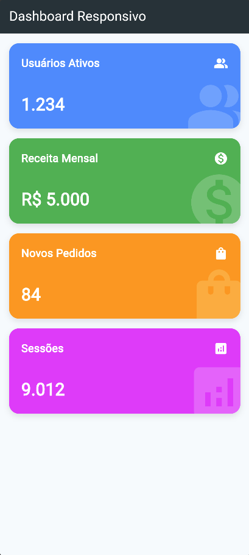
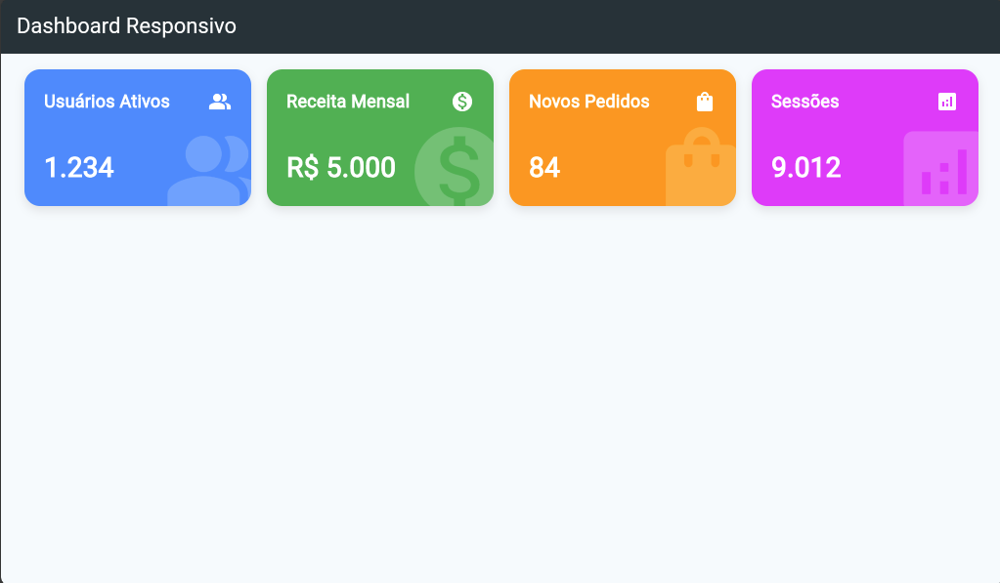
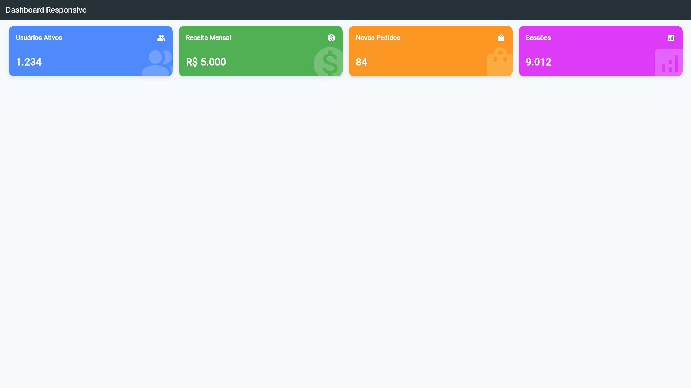

# Dashboard Responsivo em Flutter

---

## 📱 Sobre o Projeto

- Este rojeto consiste na criação de um dashboard responsivo que se adapta automaticamente a diferentes tamanhos de tela (Mobile, Tablet e Desktop). 
- A interface reorganiza seus elementos baseando-se na largura da tela utilizando `MediaQuery`, distribuindo o espaço com `Expanded` e `Flexible`, e criando sobreposições de elementos visuais com `Stack` e `Positioned`. 

---

### 📐 Breakpoints Implementados
| Dispositivo   | Largura         | Layout                                        |
| :---          | :---            | :---                                          |
| **Mobile**    | `< 600px`       | `Column` - 1 card por linha (vertical)        |
| **Tablet**    | `600px - 900px` | `Wrap` - 2 cards por linha (grid 2x2)         |
| **Desktop**   | `> 900px`       | `Row` - 4 cards na mesma linha (horizontal)   |

### 🚀 Bônus Implementados
* **Formatadores:** Formatação visual de moedas (R$) e separadores de milhar.
* **Efeitos Visuais:** Uso de `Stack` e `Positioned` para criar ícones de marca d'água no fundo dos cards.

---

## 📸 Screenshots dos Layouts

### 1. Mobile (< 600px)

### 2. Tablet (600px - 900px)

### 3. Desktop (> 900px)

